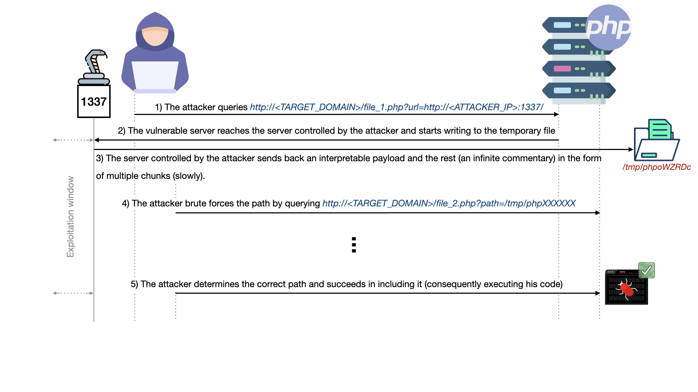
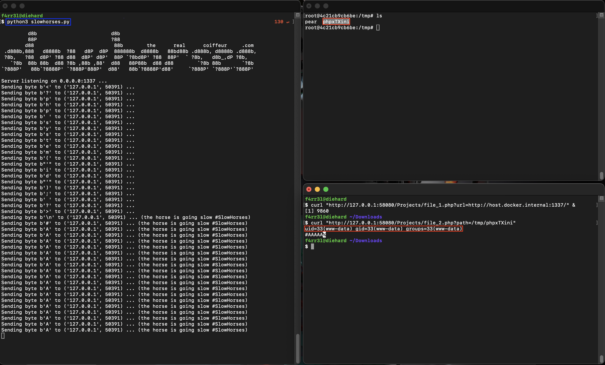

# SlowHorses

As part of my research into the exploitation of race conditions within Web
applications written in PHP, I developed this tool to make the exploitation window
wide enough during certain inclusions.

## Usage

```
$ python3 slowhorses.py

         d8b                         d8b                                                  
         88P                         ?88                                                  
        d88                           88b        the      real      coiffeur     .com     
 .d888b,888   d8888b  ?88   d8P  d8P  888888b  d8888b   88bd88b .d888b, d8888b .d888b,    
 ?8b,   ?88  d8P' ?88 d88  d8P' d8P'  88P `?8bd8P' ?88  88P'  ` ?8b,   d8b_,dP ?8b,       
   `?8b  88b 88b  d88 ?8b ,88b ,88'  d88   88P88b  d88 d88        `?8b 88b       `?8b     
`?888P'   88b`?8888P' `?888P'888P'  d88'   88b`?8888P'd88'     `?888P' `?888P'`?888P'     

Server listening on 0.0.0.0:1337 ...
```

## Example of an exploitation diagram



Which gives us on our lab:



> The payload use within the script has been replaced from `<?php phpinfo(); ?>` to `<?php system("id"); ?>`.